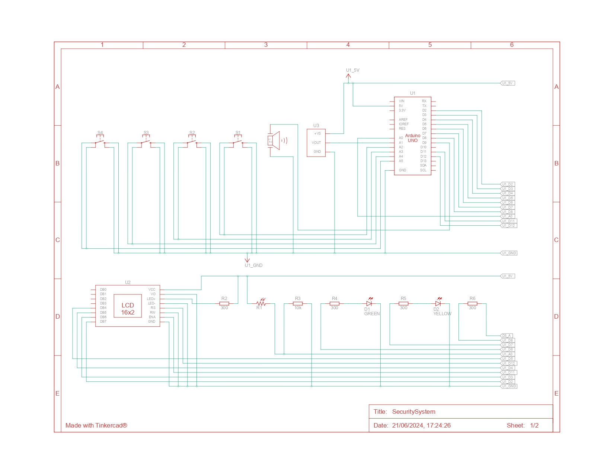
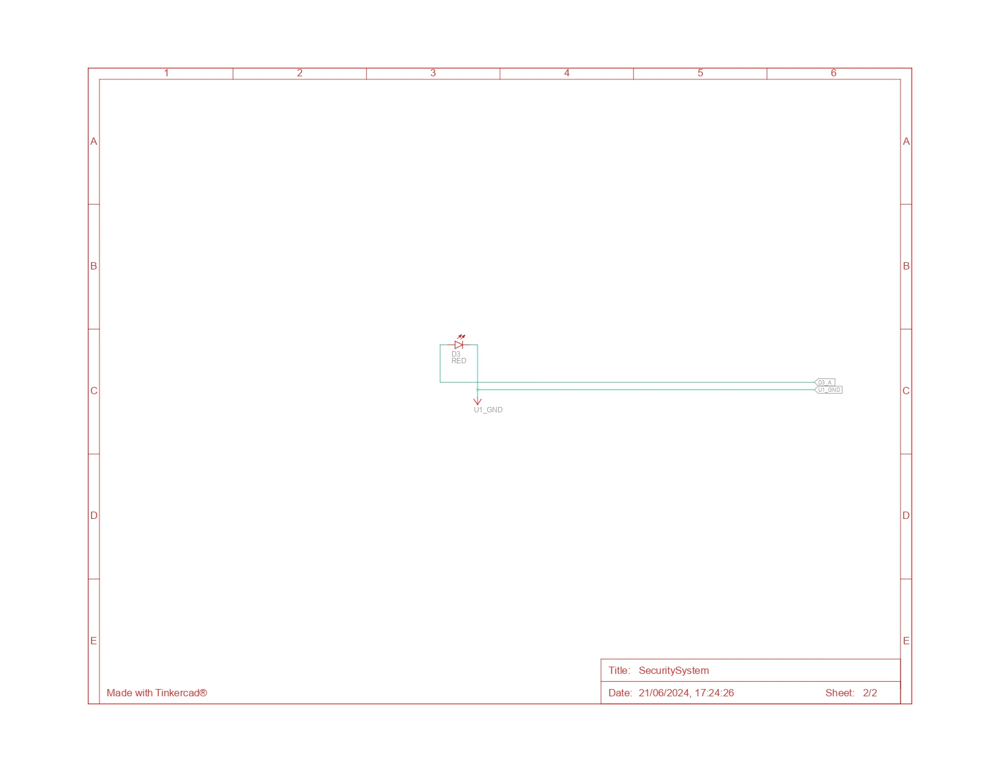
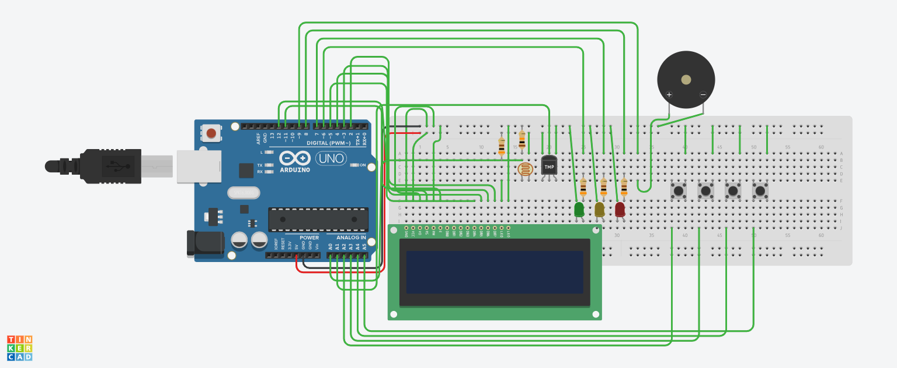
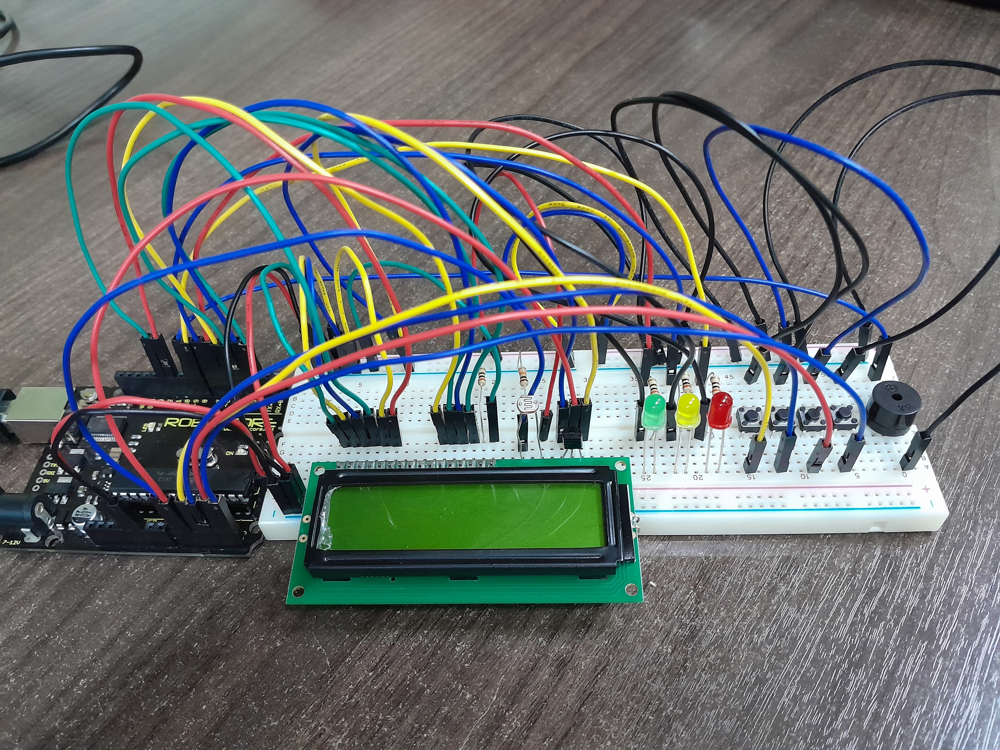

## Security System com Arduino

### Introdução

Este projeto envolve a criação de um sistema de segurança simples utilizando um Arduino, um display LCD, um sensor de temperatura (LM35), um sensor de luminosidade (LDR), LEDs de indicação, um buzzer para alarme sonoro, e botões para a entrada de um código de desativação. O objetivo é detectar invasões com base em mudanças de luminosidade e alertar o usuário através de um alarme sonoro e visual.

### Componentes Utilizados

- Arduino Uno
- Display LCD (16x2)
- Sensor de Temperatura LM35
- Sensor de Luminosidade LDR
- Resistores (10kΩ para o LDR e 220Ω para os LEDs)
- Potenciômetro (para ajuste do contraste do LCD)
- LEDs (Verde, Amarelo e Vermelho)
- Buzzer
- Botões (4 unidades)

### Link do Projeto no Tinkercad

https://www.tinkercad.com/things/iGcsmbL1qxp-securitysystem?sharecode=dmg0q8f90aRXDU_YcbJjaVesejL09TXMmSr7fhl68sY

### Diagrama de Circuito

Aqui está o diagrama de circuito do projeto no Tinkercad:

### Circuito Montado no Tinkercad

Abaixo está uma imagem do circuito montado no Tinkercad:

### Montagem Física do Circuito

Abaixo está uma foto do circuito físico montado:

### Funcionamento do Sistema

1. Monitoramento de Luminosidade e Temperatura:
   - O sistema exibe continuamente os valores de luminosidade e temperatura no display LCD.
2. Detecção de Invasão:
   - Quando a luminosidade detectada pelo LDR excede um limite definido (`ldrThreshold`), o alarme é ativado.
   - O LED vermelho acende e o buzzer soa continuamente.
3. Desativação do Alarme:
   - Para desativar o alarme, o usuário deve inserir o código de segurança correto usando os botões.
   - Cada vez que um botão é pressionado, um asterisco é exibido no display LCD.
   - Se o código inserido for correto, o alarme é desativado, o LED vermelho apaga, o LED amarelo acende, e o buzzer é desligado.

### Vídeo Demonstrativo

Veja a demonstração do circuito físico funcionando no vídeo abaixo:

### Considerações Finais

Este projeto demonstra como um sistema de segurança simples pode ser implementado usando um Arduino e componentes básicos. É uma solução eficaz para detectar invasões com base em mudanças de luminosidade e temperatura, fornecendo alertas visuais e sonoros. O projeto pode ser expandido e melhorado com funcionalidades adicionais, como comunicação remota e armazenamento de eventos.